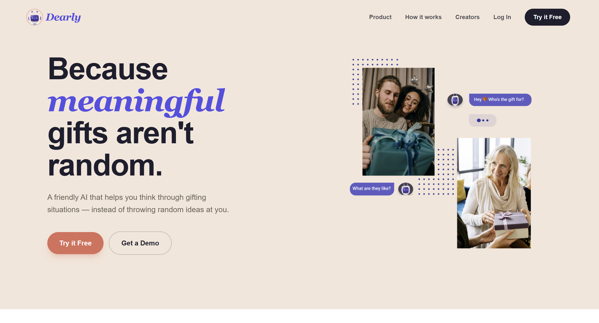
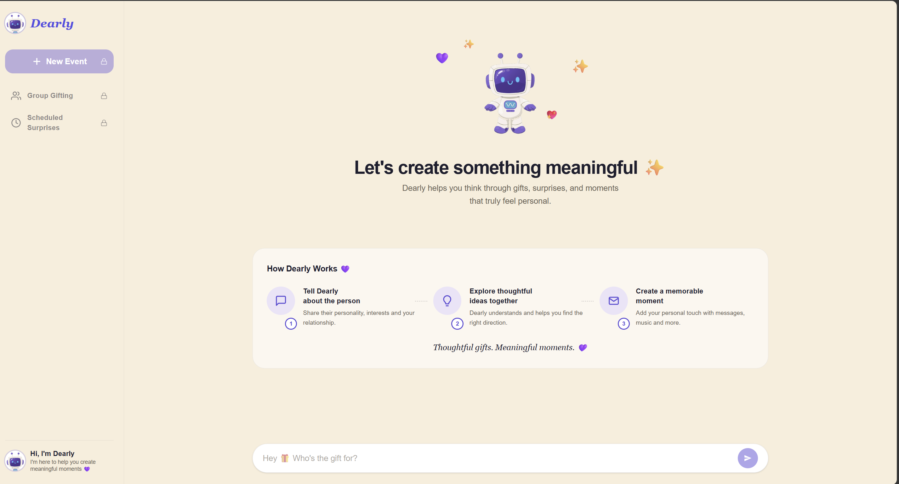
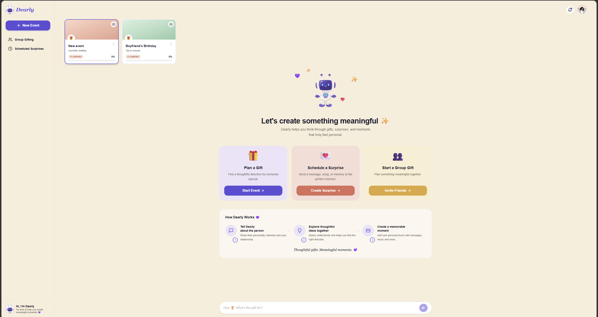
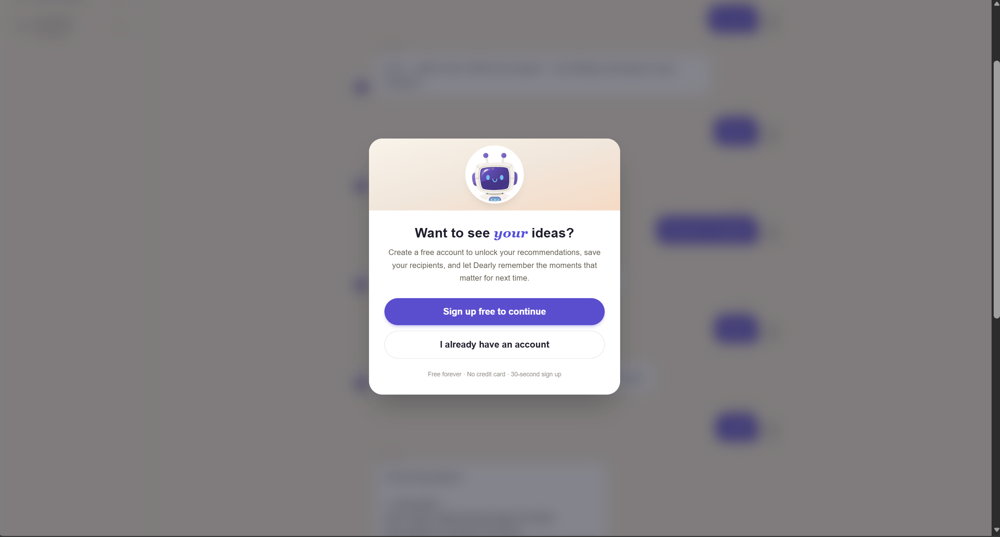

<div align="center">

# Dearly

### Because meaningful gifts aren't random.

**An AI conversational companion that helps you decide what to gift — not just what to buy.**

[](https://dearly-beryl.vercel.app)
[](https://nextjs.org/)
[](https://react.dev/)
[](https://supabase.com/)
[](https://groq.com/)
[](https://tailwindcss.com/)

[**Try the live demo →**](https://dearly-beryl.vercel.app)

</div>

---

## The Problem

Picking a thoughtful gift is one of the highest-frequency, highest-emotional-stakes decisions in everyday life. Despite hundreds of e-commerce platforms, gift-giving stays stressful: shoppers feel decision fatigue, default to repeat purchases, or settle for cash that feels impersonal.

**The friction isn't "I don't know where to buy." It's "I don't know what to give."**

Existing tools fail this:

- Marketplaces (Amazon, Flipkart) surface 10,000 SKUs and offload the decision back to the user.
- Generic AI chatbots (ChatGPT, Gemini) dump ten-item lists with no purchase path.
- Niche curators (FlowerAura, Ferns N Petals) work for one category but can't navigate context.

## The Solution

Dearly replaces *browse and pick* with *think it through together*.

Users describe a situation — who they're gifting, the occasion, the relationship, the budget — and Dearly's AI walks them through a structured conversation, asks the right follow-up questions, then converges on 2–3 specific recommendations grounded in real Google Shopping India results, complete with reasoning ("why this works", "the risk", "how to make it better").

It's intentionally narrow: not a shopping engine, not a wishlist app, not a generic AI chat. **A decision companion.**

---

## Live Demo

**Try it now → [dearly-beryl.vercel.app](https://dearly-beryl.vercel.app)**

You can use *Try It Free* without signing up. Click around. The product paywalls after the first recommendation — sign up free to continue.

---

## Screenshots

> Drop screenshots into `docs/screenshots/` and the images below will render. See "How to add screenshots" below.

<table>
  <tr>
    <td align="center"><b>Landing</b></td>
    <td align="center"><b>Conversation</b></td>
  </tr>
  <tr>
    <td></td>
    <td></td>
  </tr>
  <tr>
    <td align="center"><b>Event Dashboard</b></td>
    <td align="center"><b>Trial Paywall</b></td>
  </tr>
  <tr>
    <td></td>
    <td></td>
  </tr>
</table>

---

## Key Features

### Conversational AI Advisor
Structured 4-stage conversation flow (Opening → Mode Choice → Quick/Thoughtful → Execution) implemented as a Groq system-prompt contract. The AI returns JSON with `reply`, `choices`, `search_queries`, and `max_price_inr` — never an unbounded paragraph of ideas.

### Real Products, Budget-Aware
SerpAPI Google Shopping (India, INR) fans out one query per gift concept. A budget-tiered filter rejects mismatched prices (no ₹150 trinkets recommended on a ₹15,000 brief) and sorts by descending value-in-range.

### Multi-Event Memory
Each gifting situation is a persistent thread. Users can manage Mom's Birthday, Anniversary, and Boss's Promotion as three separate events, each with its own cover image, status badge, and conversation history.

### Rich Event Cards
Upload a cover image, drag to reposition, edit the title inline, watch the status update — every interaction is persisted to Supabase with proper RLS.

### Mandatory Trial Paywall
Free users get one full advisory conversation. The paywall blurs the chat and gates further interaction — clean wedge between curiosity and commitment.

### Mobile-Responsive
Sidebar collapses into a drawer. Hero collage scales. Event bar scrolls horizontally. Tested on iOS Safari, Chrome Android, and desktop Chrome / Firefox / Safari.

### Production-Ready Auth
Supabase email + password with proper SSR middleware. Sessions refresh transparently; protected `/chat` route redirects unauthenticated users to login.

---

## Tech Stack

| Layer | Choice | Why |
|---|---|---|
| **Framework** | Next.js 16 (App Router) | SSR for SEO; single repo for front-end + API routes; Vercel-native |
| **UI** | React 19 + Tailwind CSS 4 | Fast iteration, no design-system overhead at MVP scale |
| **LLM** | Groq (Llama 3.3 70B) | Sub-second token latency, ~95% cheaper than GPT-4 at comparable quality for this task |
| **Auth + DB + Storage** | Supabase (Postgres) | One vendor for the four hardest infra problems; RLS for free; managed Postgres |
| **Product Retrieval** | SerpAPI Google Shopping (gl=in) | Live data, India-localized, no scraping risk |
| **Hosting** | Vercel | Zero-config Next.js, instant rollback, preview branches |
| **CI/CD** | GitHub → Vercel auto-deploy | Push to `main` → live in ~60 seconds |

---

## Architecture

```
┌─────────────────────────────────────────────────────────────────┐
│                          User (Browser)                          │
└────────────────────────────┬────────────────────────────────────┘
                             │ HTTPS
┌────────────────────────────▼────────────────────────────────────┐
│                       Next.js on Vercel                          │
│  ┌────────────────────┐    ┌──────────────────────────────────┐ │
│  │ React (App Router) │    │  API Route: /api/chat            │ │
│  │  - Landing         │    │  1. Groq LLM (JSON contract)     │ │
│  │  - Chat UI         │◄──►│  2. SerpAPI fan-out (parallel)   │ │
│  │  - Modals          │    │  3. Budget-tier filter           │ │
│  └────────────────────┘    │  4. Compose reply + products     │ │
│             │              └──────────────┬───────────────────┘ │
└─────────────┼─────────────────────────────┼─────────────────────┘
              │                             │
              ▼                             ▼
   ┌──────────────────────┐    ┌────────────────────────────┐
   │  Supabase            │    │  External APIs             │
   │   - Auth (cookies)   │    │   - Groq /chat/completions │
   │   - Postgres + RLS   │    │   - SerpAPI google_shopping│
   │   - Storage (images) │    │                            │
   └──────────────────────┘    └────────────────────────────┘
```

### Conversation Turn — Latency Budget

| Stage | p50 | p95 |
|---|---|---|
| Network round-trip | 120 ms | 300 ms |
| Groq inference (Llama 3.3 70B) | 800 ms | 1.6 s |
| SerpAPI batch (3 parallel) | 1.2 s | 3.0 s |
| Server composition | 30 ms | 80 ms |
| Client render | 20 ms | 60 ms |
| **End-to-end perceived** | **2.2 s** | **5.0 s** |

---

## Project Structure

```
dearly/
├── app/
│   ├── api/chat/route.js       # LLM + SerpAPI orchestration
│   ├── auth/callback/route.js  # Supabase OAuth return URL
│   ├── chat/page.js            # Main authenticated dashboard
│   └── page.js                 # Landing + login/signup modal
├── components/
│   └── ProfileModal.js         # Avatar + display name editor
├── lib/supabase/
│   ├── client.js               # Browser client
│   ├── server.js               # Server-side client (cookies)
│   └── middleware.js           # Session refresh helper
├── public/                     # Robot avatars, hero illustrations
├── proxy.js                    # Next.js 16 middleware (auth gate)
├── next.config.mjs             # Image domains, lint config
└── Dearly-PRD.docx             # 30-page product requirements doc
```

---

## Local Setup

```bash
# 1. Clone the repo
git clone https://github.com/GulshaPanda/dearly.git
cd dearly

# 2. Install dependencies
npm install

# 3. Set up environment variables
cp .env.example .env.local
# Then fill in the four keys (see .env.example)

# 4. Run the dev server
npm run dev

# 5. Open http://localhost:3000
```

### What you need

| Variable | Get it from |
|---|---|
| `GROQ_API_KEY` | [console.groq.com](https://console.groq.com) — free tier is plenty |
| `SERPAPI_KEY` | [serpapi.com](https://serpapi.com) — 100 free searches / month |
| `NEXT_PUBLIC_SUPABASE_URL` | [supabase.com](https://supabase.com) → New project |
| `NEXT_PUBLIC_SUPABASE_ANON_KEY` | Same Supabase project, Settings → API |

### Database setup

After creating a Supabase project, run the SQL in `docs/schema.sql` to create the `events` and `messages` tables, enable RLS, and create the `avatars` storage bucket.

---

## Product Documentation

The full product requirements document is committed in this repo:

**[Dearly-PRD.docx](Dearly-PRD.docx)** — 19-section PRD covering problem framing, market sizing, personas, competitive analysis, functional requirements, data model, monetization strategy, GTM plan, risks, and 12-month roadmap. Written at the level of a senior PM at a top tech company.

---

## Roadmap

**V1 (shipped)** — Conversational AI flow, product retrieval, multi-event memory, trial paywall, mobile-responsive.

**V1.5 (next 90 days)** — Auto-extract event metadata from chat, calendar reminders via email, forgot-password, Google OAuth, PostHog analytics.

**V2 (3–6 months)** — Pro subscription (₹199/mo), Surprise Delivery composer, recipient profiles with full gift history, Product Hunt launch.

**V3 (6–12 months)** — Group gifting with UPI split, curated small-business marketplace (affiliate revenue), WhatsApp bot, Hindi localization.

Full roadmap with KPIs and OKRs in the [PRD](Dearly-PRD.docx).

---

## What I'd Build Differently

Honest reflection from someone who actually shipped this:

- **Event auto-extraction was a missed V1 unlock.** Today users edit the title manually. The AI already knows it's "Mom's Birthday" by message two — should have piped that into the events table from day one.
- **The paywall is too hard for the test cohort.** Smart bet for monetization signal, but probably costs me early word-of-mouth. I'd A/B a softer 2nd-recommendation paywall in V1.5.
- **No analytics in V1.** I'm flying blind on the trial → signup funnel. PostHog is the first V1.5 task.
- **Email confirmation off in production.** A velocity call to ship faster; before scaling, this gets flipped on with a proper transactional email service (Resend).

---

## About the Author

**Gulsha Panda** — building products for the Indian consumer market.

I designed, scoped, built, deployed, and shipped this end-to-end as a portfolio project for APM applications. The repo includes the PRD, the codebase, the live product, and this README — together they're meant to demonstrate the full PM-meets-builder loop, not just spec-writing.

- Email: gulshapanda@yahoo.com
- LinkedIn: *(add your link)*
- Twitter / X: *(add your link)*

---

## License

MIT — see [LICENSE](LICENSE).

---

<div align="center">

**If you found this interesting, star the repo — it helps a lot.**

</div>
